# Multi-Store Inventory Management System
# Based on : Object-oriented PHP, Bootstrap framework, AJAX, and JavaScript. 
## Developed By
> <b>Abu Sufiun</b> 
> <b>abusufiun27@gmail.com</b> 
> +880 1878 000 675 
> Application Development - Officer - Hop Lun  

Welcome to our Multi-Store Inventory Management System! This robust solution is designed to enhance security through domain authentication, ensuring that external users from other companies cannot access the system.
>That can handle multiple factory sub-stores inventory from one application.  
> Different level authorization and authentication level. 
> Keep track buy and sell price and lot numbers and return policy. 
> Generate finance report employee, department, stores and companies.

## Features

- **Domain Authentication:** External users from other companies are restricted from accessing the system.
- **Separate Databases:** Each factory has its own database, allowing for the creation of multiple stores within each factory, with each maintaining its records independently.
- **Various Types of Stores:**
  - General Store: Offers everyday items like paper, pens, tea, etc.
  - IT Store: Provides computer peripherals such as keyboards, mice, PCs, etc.
  - Machinery Store: Supplies industrial equipment like swingline parts, etc.
  - Electrical Store: Deals in electrical components like cables, switches, etc.
- **Authorization Permissions:** Categorized into User and Admin roles.
- **Super Admin Panel:** Provides comprehensive monitoring capabilities for all factory stores, sub-stores, and their respective records.

## Technologies Used

- **Programming Language:** PHP (Object-Oriented Programming)
- **Frontend:** Bootstrap, CSS, JavaScript, HTML
- **Database:** Microsoft SQL Server
- **Server:** IIS (Internet Information Services)

## Key Features

1. **Unified Pricing:** Ensures consistent pricing for products purchased and issued within a factory.
2. **Partial Returns:** Allows partial returns of issued products and return of purchased items to suppliers.
3. **Replacement Tracking:** Monitors records of replacement-issued products.
4. **Stock Management:** Sets stock-out ROL (Reorder Level) reminder quantities and enables partial product receipts.
5. **Employee and Supplier Management:** Inactivates/activates employees, departments, or suppliers to restrict transactions with them.

## Transaction Tracking

The system meticulously records every transaction, including who issued or purchased a product, date, time, and user trace records. This detailed tracking facilitates investigations in case of any discrepancies.

## Report Generation

The system generates a variety of reports, including:
- Employee-wise cost analysis
- Department-wise cost breakdown
- Item-wise cost summary
- Balance chart for inventory
- Invoice-wise balance reports
- Category-wise cost analysis

## Conclusion

Our Multi-Store Inventory Management System is tailored to meet your diverse needs, providing a comprehensive and secure solution for efficient inventory management.

# Graphical view of Store Inventory
## <b>Dashboard:</b> from dashboard we can view current balance and other information’s.

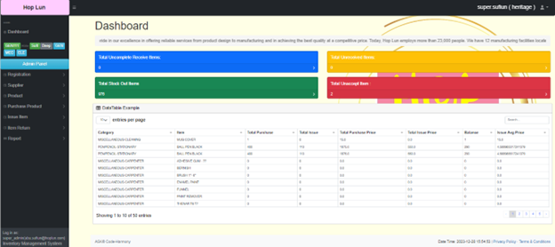

## <b>Employee Section:</b> we can manage department, employees also can be edit active/inactive

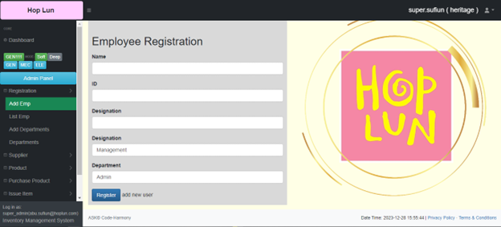
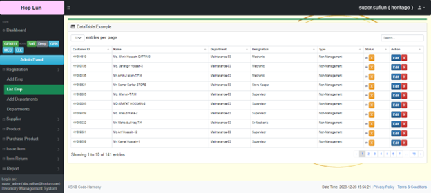

## <b>Supplier:</b> can add active/inactive modifications
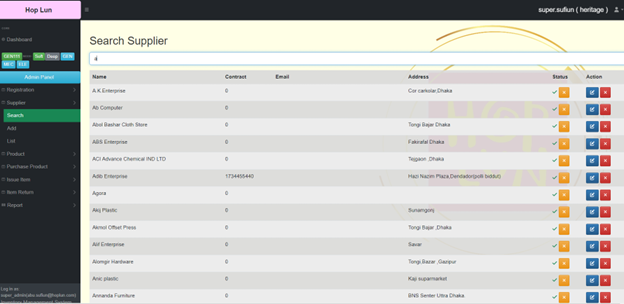

## <b>Product:</b> can add items, category allow modifications also can be active/inactive
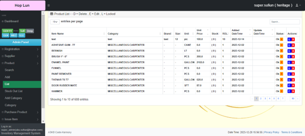

## <b>Purchase:</b> can be purchase product partially there have admin user heretical access policy. After admin accept user can receive the product. Moreover can be return the purchase product to supplier.
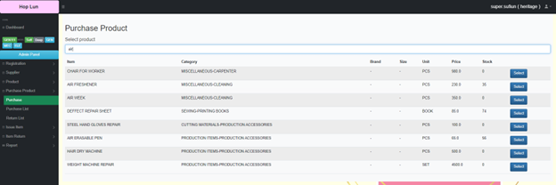
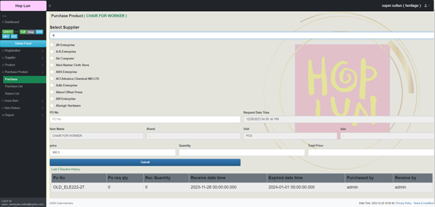
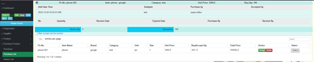
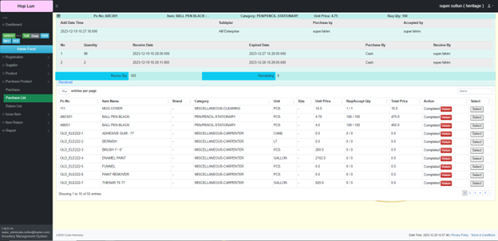

## <b>ISSUE:</b> from purchase products
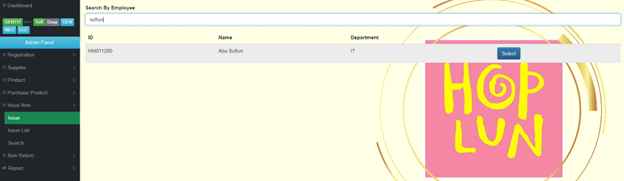
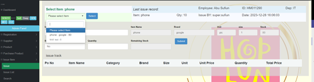
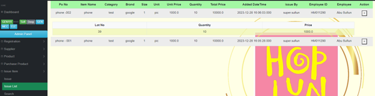

## <b>Retuen:</b> from issue products
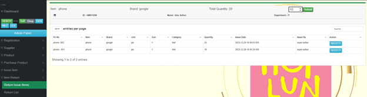
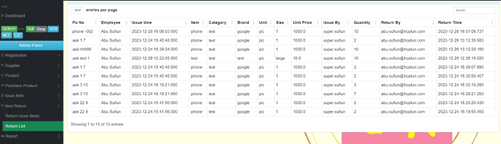

## <b>Report view and export to excel sheet</b> 
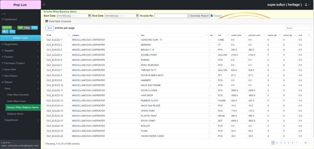
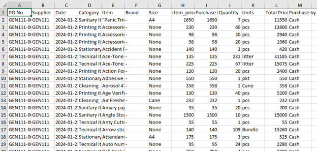